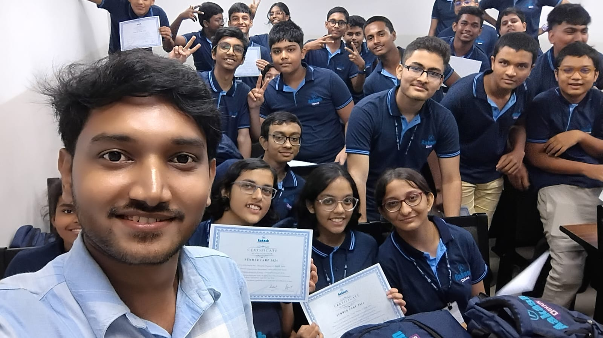

  

## ⚡ Fun Fact
*"I see problems → I break them → I strategize → I persist → I won’t rest until I’ve pieced them together."*

## 📫 Connect with Me:
I am a people person, let's connect!

  

  
  
  

## 💼 Portfolio

Check out my portfolio where you can explore my projects and learn more about what I do:

[Portfolio](https://sumitportfoliowebsite.netlify.app/)

## ⚙️ Technologies & Tools

Here are the technologies and tools I work with:

  
  
  

  
  
  

  
  
  
  
  

  
  

  
  

  

  
  
  

### 🌟 Notable Projects
- 🍽 [Restaurant Management System](https://github.com/Sumit0134/Restaurant-Management-System) – MongoDB, Express, Node
- 🎒 [Scatch - A Premium Bag Shop](https://scatch-6sgl.onrender.com/) 👜 - MongoDB, Express, Node, EJS, Tailwind CSS
- 👤 [UserCRUD](https://usercrud-r3cc.onrender.com/) – MongoDB, Express, Node, EJS, Tailwind CSS  
- 🗂 [Task Manager](https://task-manager-nwrr.onrender.com/) – Express, Node, EJS, File System, Tailwind CSS
- 🐦 [Twitter Clone](https://sumittwitterclone.netlify.app/) - HTML5, Tailwind CSS, Vite
- 🎵 [MusicBar](https://github.com/Sumit0134/Music-Bar) – HTML5, CSS3, JavaScript 
- 🎬 [Netflix Clone](https://kaleidoscopic-sprinkles-11bfb8.netlify.app/) – HTML5, CSS3
  
### 📚 Cheat Sheets
Here are some of the cheat sheets I’ve created for **HTML5** and **Git & GitHub**:

- 🌐 [HTML5 Cheat Sheet](https://azure-briny-88.tiiny.site/) – A comprehensive guide to HTML5 tags, attributes, and syntax.  
- 💻 [Git & GitHub Cheat Sheet](https://aquamarine-susette-51.tiiny.site/) – A quick reference for essential GitHub workflows and commands.

## 📊 GitHub Stats

## 📈 GitHub Streak Stats

